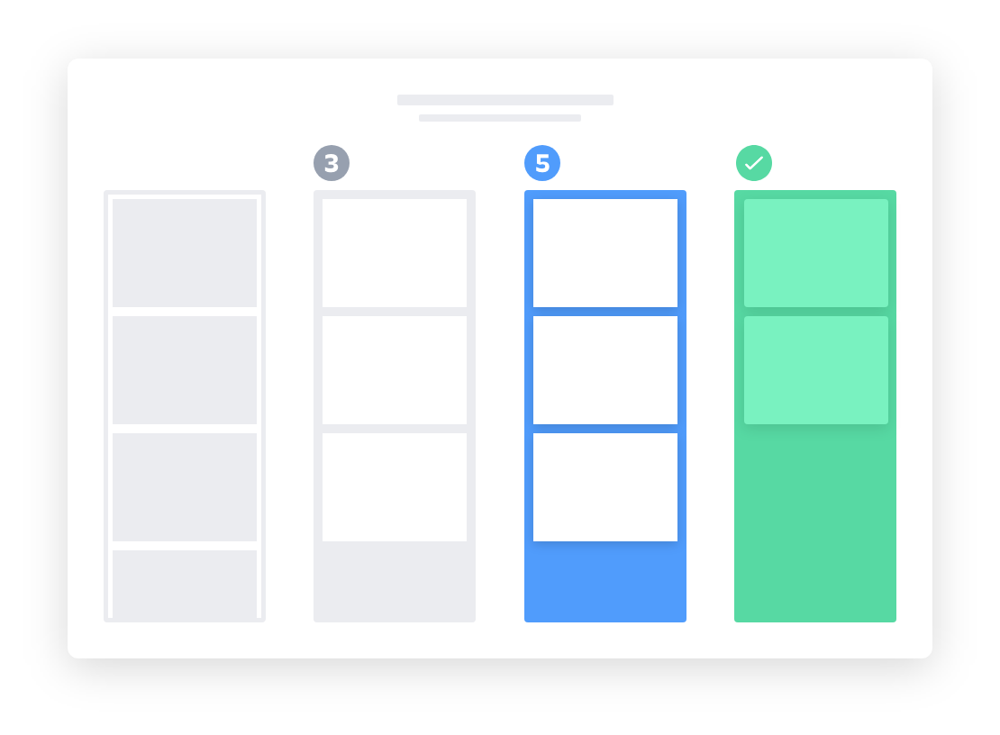

# DevCenterProject
This github project is created as a part of devCenter Project formulation
## TASK: Notify the assignee the due dates via email using basic kanban Board.

## what is a kanban board?
A kanban board is an agile project management tool designed to help visualize work, limit work-in-progress, and maximize efficiency (or flow). Kanban boards use cards, columns, and continuous improvement to help technology and service teams commit to the right amount of work, and get it done!

## GitHub 
GitHub is a code hosting platform for collaboration and version control.
GitHub lets you (and others) work together on projects.

## GitHub essentials are:
  ->Repositories\
  ->Branches\
  ->Commits\
  ->Pull Requests\
  ->Git (the version control software GitHub is built on)
  
## Build a fully automated kanban power-up for your GitHub Project board  
Managing the software development process can be a bit of time consuming.This is often not due to the actual coding aspect of it but more often than not, it is due to the tools fatigue you get from incorporating different tools to manage the whole process. Hence, build a fairly simple and extensible kanban power-up for GitHub Projects that automates the triaging of new issues to project boards and to track issue statuses automatically.
  
## Display the due date notification to assignee 

Language used: ruby.

The Due date notification is exclusively built as a tool which can be handy for any software developer. As most of the time the due dates are the crucial in the life cycle of any product. Hence keeping the work organised becomes atmost important.

## steps of workflow that will be followed while implementaion.

1. Notification reminder function for watcher, issue, days left\
2.sending email function without any cc and bcc fields mentioned\
3.give the comman github headers\
 Common headers\
    headers 'X-Mailer' => 'GitHub',\
            'X-GitHub-Host' => Setting.host_name,\
            'X-GitHub-Site' => Setting.app_title,\
            'Precedence' => 'bulk',\
            'Auto-Submitted' => 'auto-generated'
4. Raise errors if the email was not able to be sent to the user.

Note: Steps will be modified if pieces doesnt fit as per requirement.
